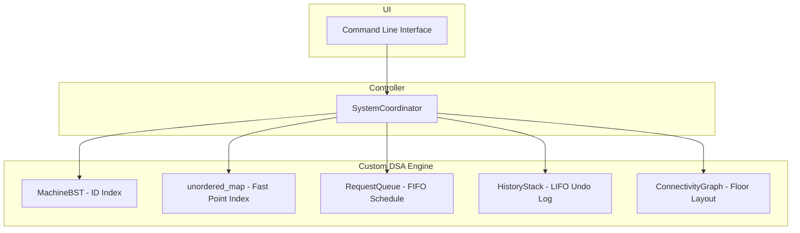

# Smart Industrial Equipment Maintenance & Predictive Monitoring System

---

## 2.1 Project Title
**Smart Industrial Equipment Maintenance & Predictive Monitoring System**

---

## 2.2 Problem Statement
Industrial facilities houses complex machines that are critical to daily operations. Unexpected failures and uncoordinated maintenance lead to:
1. **Financial Loss**: Unplanned downtime delays production schedules.
2. **Resource Mismanagement**: Maintenance requests are resolved arbitrarily instead of prioritizing critical faults first.
3. **Technician Inefficiency**: Maintenance workers waste time navigating factory floor plans without optimized path routing.

This system provides a centralized dashboard to track machine health, prioritize repair jobs, log update histories, and map floor navigation routes.

---

## 2.3 Objectives
- **Dynamic Asset Registry**: Maintain active machine statuses using a Binary Search Tree (BST) and Hash Map.
- **Urgency Dispatch Queue**: Schedule repair tasks fairly in FIFO order.
- **Rollback Log**: Support multi-level safety undos using a custom Stack.
- **Floor Mapping & Traversals**: Model machine pathways as a Weighted Graph, utilizing BFS for outage propagation and DFS for dependency safety.
- **Route Optimization**: Run Dijkstra's algorithm to guide technicians to machine coordinates using the shortest physical route.

---

## 2.4 System Overview / Architecture
The project is built on an Object-Oriented design in C++:

- **Entity Layer**: Includes the `Machine` (properties, predictive health, statuses) and `Request` classes.
- **Storage Layer**: Organizes entries using custom data structures (`MachineBST`, `RequestQueue`, `HistoryStack`, `ConnectivityGraph`).
- **Orchestration Layer**: The `SystemCoordinator` links individual data structures to keep indexes and traversals synchronized.



---

## 2.5 Data Structures and Algorithms Used
1. **Binary Search Tree (BST)**: Primary machine storage ordered by ID.
2. **Hash Table (`unordered_map`)**: High-speed lookup index mapping IDs to machine records.
3. **Queue**: Linked-list based FIFO scheduler for maintenance requests.
4. **Stack**: Linked-list based LIFO log for rolling back edits.
5. **Graph (Adjacency List)**: Physical floor layouts and connection weights.
6. **BFS**: Breadth-First traversal starting from failed nodes to check outage spreads.
7. **DFS**: Depth-First traversal recursively tracing safety chains.
8. **Dijkstra's Algorithm**: Single-source shortest path planning for technicians.
9. **Merge Sort**: Stable divide-and-conquer sorting by calculated priority.
10. **Searching**: Linear Search (by name) and Binary Search (by ID on sorted data).

---

## 2.6 Implementation Approach
- **Singly Linked Lists**: Custom Queue and Stack classes are built from scratch using head/tail nodes, avoiding standard library wrappers to demonstrate dynamic memory allocations.
- **Pointer BST**: Node deletion handles single-child, no-child, and two-child nodes (replacing data with inorder successor pointers).
- **Array-based Dijkstra**: Distance relaxation is solved using simple arrays to keep logic clear and readable for viva code reviews.
- **Clean Input Handler**: Employs stream validation checks (`cin.clear()`, `cin.ignore()`) to intercept buffer errors.

---

## 2.7 Time and Space Complexity Analysis

| DSA Element | Operation | Average Complexity | Worst Case Complexity | Space Complexity |
| :--- | :--- | :--- | :--- | :--- |
| **BST** | Insert / Delete / Search | $O(\log N)$ | $O(N)$ | $O(N)$ |
| **Hash Table** | O(1) Search Index | $O(1)$ | $O(N)$ | $O(N)$ |
| **Queue** | FIFO Enqueue / Dequeue | $O(1)$ | $O(1)$ | $O(1)$ per node |
| **Stack** | LIFO Push / Pop | $O(1)$ | $O(1)$ | $O(1)$ per node |
| **Graph** | Layout Storage | $O(V + E)$ | $O(V + E)$ | $O(V + E)$ |
| **Merge Sort** | Priority Ranking | $O(N \log N)$ | $O(N \log N)$ | $O(N)$ |
| **Linear Search** | String Match Lookup | $O(N)$ | $O(N)$ | $O(1)$ |
| **Binary Search** | Divisive ID Search | $O(\log N)$ | $O(\log N)$ | $O(1)$ |
| **BFS / DFS** | Node traversal | $O(V + E)$ | $O(V + E)$ | $O(V)$ |
| **Dijkstra** | Path Optimization | $O(V^2)$ | $O(V^2)$ | $O(V + E)$ |

---

## 2.8 Execution Steps

### Prerequisites
Ensure you have a C++ compiler supporting C++17 (such as GCC or Clang) installed on your system.

### Compilation
Open a terminal in the project directory and run:
```bash
g++ -std=c++17 -Wall -Wextra main.cpp -o main
```

### Execution
Run the compiled executable:
```bash
./main
```

---

## 2.9 Sample Inputs and Outputs

### Adding a Machine
- **Input**:
  - Choice: `1`
  - ID: `106`
  - Name: `Laser Cutter`
  - Location: `Aisle C`
  - Faults: `1`
- **Output**:
  ```text
  Machine successfully added.
  ID:   106 | Name: Laser Cutter              | Location: Aisle C              | Health:  90% [Healthy         ] | Faults: 1
  ```

### Priority Schedule
- **Input**:
  - Choice: `9`
- **Output**:
  ```text
  =========================================================================================
                            MAINTENANCE SCHEDULE (MERGE SORT PRIORITY)
  =========================================================================================
  Rank      Priority    ID      Machine Name             Status         Health
  -----------------------------------------------------------------------------------------
  1         90          103     Hydraulic Press          Critical       40%
  2         60          104     Injection Molding MachineMaintenance Soon60%
  3         30          101     CNC Milling Machine      Healthy        80%
  4         15          106     Laser Cutter             Healthy        90%
  5         10          105     Industrial Air CompressorHealthy        90%
  6         0           102     Robotic Welding Arm      Healthy        100%
  =========================================================================================
  ```

---

## 2.10 Screenshots
*(Below are simulated CLI outputs representing the main operations.)*

### Main Menu Interface
```text
=============================================
                  MAIN MENU
=============================================
 1. Add Machine
 2. Search Machine
 3. Update Machine
 4. Delete Machine
 5. Display Machines
 6. Add Maintenance Request
 7. Process Maintenance Request
 8. Undo Last Update
 9. Sort Machines By Priority
10. Connect Machines
11. Run BFS
12. Run DFS
13. Run Dijkstra
14. Exit
=============================================
```

### Routing Results
```text
=============================================================
                  DIJKSTRA ROUTE PATH PLANNER
=============================================================
Shortest Path Distance: 57.0 meters

Step-by-Step Path:
  Technician Room (ID: 0) -> CNC Milling Machine (ID: 101) -> Hydraulic Press (ID: 103) -> Industrial Air Compressor (ID: 105)
=============================================================
```

---

## 2.11 Results and Observations
1. **Constant-time point queries**: Paired indexing (BST + Hash Map) maintains $O(1)$ point-lookups for ID searches while allowing $O(N)$ sorted reports.
2. **Stable Sorting**: Merge Sort successfully organizes priority queues without changing the relative order of items with identical priority values.
3. **Technician Path Optimization**: Dijkstra's algorithm selects the optimal path (routing `0 -> 101 -> 103 -> 105` in 57m instead of 63m), reducing repair latency.

---

## 2.12 Conclusion
The **Predictive Monitoring System** demonstrates the integration of multiple data structures. Using custom pointer logic for BSTs, stacks, queues, and graph algorithms, the system coordinates database management, priority scheduling, and technician navigation in a clean, warning-free code layout.
